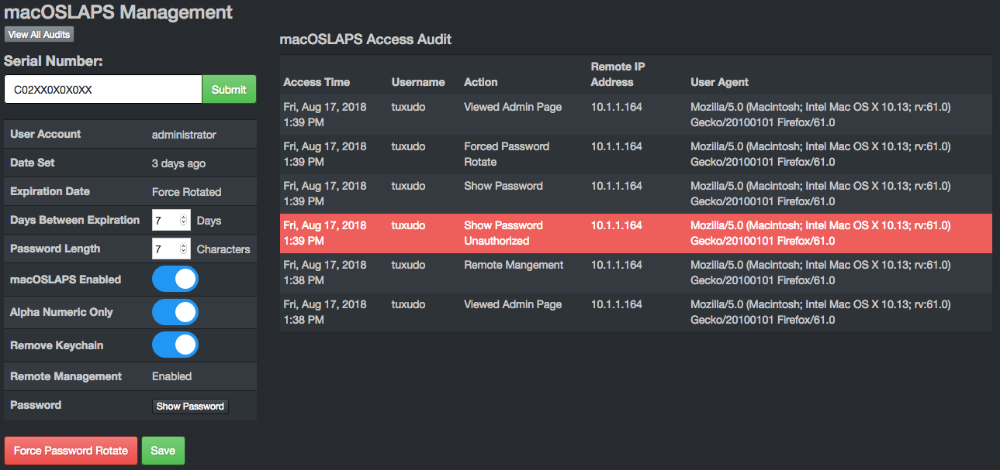

# macOSLAPS module

This module uses a modified version of Joshua Miller's macOSLAPS script: [https://github.com/joshua-d-miller/macOSLAPS-Legacy](https://github.com/joshua-d-miller/macOSLAPS-Legacy)

The table provides the following information per client:

+ useraccount - User account of local admin whose password MunkiReport has
+ password - Encrypted password of local admin account
+ dateset - Epoch of when password was last set
+ dateexpires - Epoch of when password expired
+ script_enabled - Boolean of if password changing is enabled on client
+ days\_till_expiration - Number of days between changing password
+ alpha\_numeric_only - Boolean of if password should only contain alphanumeric characters
+ keychain_remove - Boolean of if local admin keychain should be deleted when password is changed
+ pass_length - Length of the new password
+ remote_management - Boolean of if remote management is enabled
+ audit - JSON array of auditing records

# Remarks

Module requires a crypto key. It can be made by calling `vendor/defuse/php-encryption/bin/generate-defuse-key` in the root of the munkireport directory or by visiting the macOSLAPS Management page in the Admin dropdown menu. Add the resulting key to `config.php` as `$conf['laps_encryption_key'] = 'def00000505fe726...34'`. The local password is encrypted before it enters the database and is decrypted after retrieval. Don't lose the encryption key or your local passwords are lost forever!

To control password decryption, you can set `$conf['laps_password_decrypt_enabled']` to `FALSE`. This will globally disable the show password buttons in the UI and sending the decrypted password out via API. To limit password decryption to only certain users, add their username to the `$conf['view_laps_password']` array. If this array is commented out, everyone will be able to view the password or access them via the API. The `$conf['laps_password_decrypt_enabled']` config overrides the `$conf['view_laps_password']` config when disabling all password viewing.

This module will not run if Joshua Miller's script/binary is installed, as they will conflict and cause problems.

macOSLAPS script is triggered and run by MunkiReport's preflight script. 

Uses similar preferences to the macOSLAPS script and will respect profiles if used. Preference domain is `org.munkireport.laps` and has the following options:

* `LocalAdminAccount` - Short username of the local admin account to cycle the password for, default is `admin`
* `PasswordLength` - Length of password to set, default is `12`
* `DaysTillExpiration` - How long until the password is reset, default is `60`
* `RemoveKeyChain` - Remove the keychain of the local admin, default is `True`
* `AlphaNumericOnly` - Use only alphanumeric characters when making the password, default is `True`
* `RemovePassChars` - Characters to not include in the password, default is `'{}[]|`
* `Enabled` - If set to `True` macOSLAPS script will change password when it expires, default is `True`
* `RemoteManagementEnabled` - If `True` script will prioritize settings pulled from MunkiReport's database over local preferences, defaults, and profiles, default is `True`

Module will delete cached password after it verifies password is stored on MunkiReport server. This script will not (yet) change the local admin user's FileVault 2 password, if that account is authorized to unlock the drive.

Client log can be found at `/Library/Logs/macOSLAPS.log`

Module supports remote management under the Admin>macOSLAPS Management page. Clients will first populate preferences with built in defaults or from profile on first run, unless client is already in MunkiReport's `laps` table. Available in the macOSLAPS Admin page are options to configure supported remote management settings, force the password to be cycled, and viewing of the audit trail. All actions are audited server side. The audit trail is viewable within the macOSLAPS Management page for either one serial number or all audit logs.